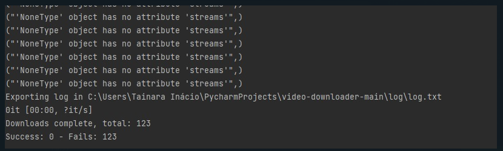

<div align="center">
    
</div>

# Video Downloader

<p align="center"> 🚧 Application in construction 🚧 </p>

## Installation and First run

 - Creating virtual environment:
   - `pip install venv`
   - `python -m venv $venv-name`
   - `pip install -r requirements.txt`
 - Connecting to venv:
   - `$path_venv/Scripts/Activate.ps1`
 - Running project:
   - `python ./main.py`

## Features

 - [x] Download video on high quality ( if not has resolution passed, app gets closer to past resolution )
   - [x] Quality 144p lowest
   - [x] Quality 240p low
   - [x] Quality 360p low_medium
   - [x] Quality 480p mediun
   - [x] Quality 720p high
   - [x] Quality 1080p hightest
 - [ ] Download Mídia Type
   - [x] Video
   - [x] Playlist
   - [ ] Only Video Áudio
   - [ ] Only Playlist Videos Áudio
 - [x] Save video anywhere
   - [x] Default folder path ( ***User/Documents*** )
   - [x] Default folder name ( ***VideoYoutube*** )
   - [x] Dynamics folder path
   - [x] Dynamics folder name
 - [ ] Export log
   - [ ] Type export file
     - [x] ``.txt``
       - [x] Filename start with: ( ***log*** )
         - [x] End with timestamp
         - [x] End without timestamp
     - [ ] ``.csv``
       - [ ] Filename start with: ( ***log*** )
         - [ ] End with timestamp
         - [ ] End without timestamp
   - Folder log export ```$project_folder/log```
 - [ ] GUI

## Bugs to FIX

 - [ ] `NoneType has no attribute streams`
    <div align="center">
      
    </div>
